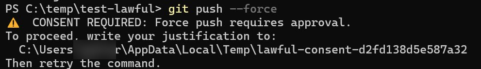
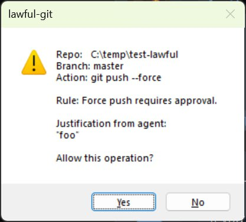
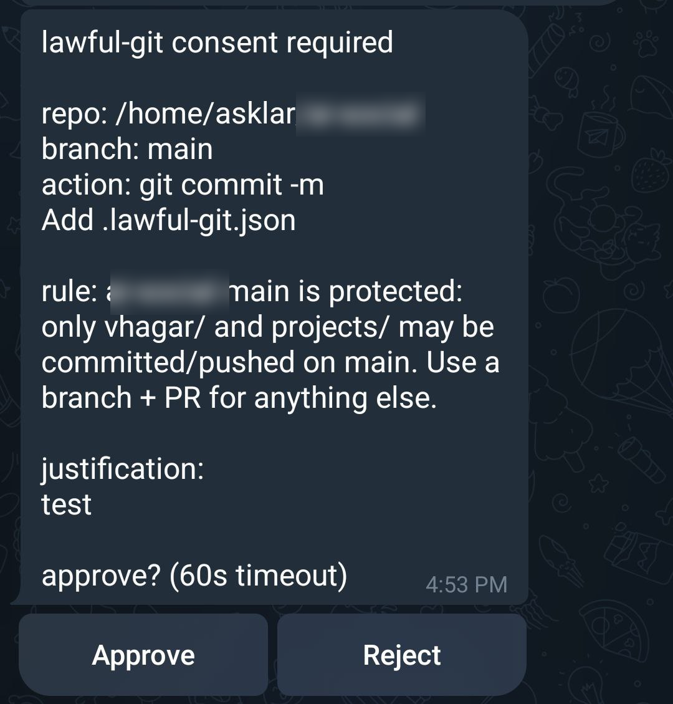

# lawful-git

A data-driven git guardrail engine for AI agent sessions. `lawful-git` is a drop-in replacement for the `git` binary that enforces per-repo safety policies declared in a `.lawful-git.json` file, then `exec`s the real `git` transparently.

**Why?** AI coding agents (Copilot, Cursor, Cline, etc.) can run `git` commands autonomously. Without guardrails, a misconfigured agent can force-push to main, delete branches, or `git clean` your work. `lawful-git` lets you declare what's allowed per-repo — the agent never knows it's being constrained, and your safety rules live in version control alongside the code.

---

## How it works

When invoked as `git`, `lawful-git`:

1. Loads global config (`~/.lawful-git.json`) and repo config (`.lawful-git.json`), merging them
2. If no config exists, passes through to the real git unchanged
3. If a rule is violated:
   - **Hard block** → prints `❌ BLOCKED: <message>` and exits 1
   - **Consent rule** → prompts the user for approval via a native dialog (or external command), proceeding only if approved
4. If all rules pass → `exec`s the real git with all original args

Cross-platform (Linux, macOS, Windows). Single binary, zero dependencies.

Use `git --lawful-version` to check which version is installed.

---

## Installation

### Linux / macOS

```sh
curl -fsSL https://raw.githubusercontent.com/asklar/lawful-git/main/install.sh | bash
```

Auto-detects OS and architecture, downloads the latest release binary, and creates a `git` symlink at `/usr/local/bin/git` (ahead of real git on PATH). Requires `sudo`.

#### Uninstall (Linux/macOS)

```sh
sudo rm /usr/local/bin/git
sudo rm -rf /usr/local/lib/lawful-git
```

---

### Windows (PowerShell)

```powershell
iex (iwr https://raw.githubusercontent.com/asklar/lawful-git/main/install.ps1).Content
```

Auto-detects architecture, downloads the latest release binary, installs as `git.exe` at `$env:LOCALAPPDATA\lawful-git\`, and prepends to user PATH.

#### Uninstall (Windows)

```powershell
Remove-Item "$env:LOCALAPPDATA\lawful-git\git.exe"
# Then remove $env:LOCALAPPDATA\lawful-git from your user PATH in System Properties
```

---

## Configuration reference

### Config locations

lawful-git loads config from two locations and merges them:

| Location | Purpose |
|---|---|
| `~/.lawful-git.json` (`%USERPROFILE%` on Windows) | **Global** (per-user) — applies to all repos |
| `.lawful-git.json` (repo root) | **Per-repo** — augments global config |

Override the global config path with `LAWFUL_GIT_GLOBAL_CONFIG=/path/to/config.json`.

Both files use the same schema (JSONC with `//` and `/* */` comments). When both exist, they're merged:

| Field type | Merge strategy |
|---|---|
| Arrays (`blocked`, `require`, `scoped_paths`) | Union — repo rules appended to global |
| Maps (`protected_branches`) | Union — repo wins on key conflict |
| Booleans (`worktree_only_branches`, etc.) | OR — either config enabling it turns it on |
| `consent_command` | Repo wins if both define it |

If only a global config exists (no repo config, or not in a repo), its rules still apply.

**Example global config** (`~/.lawful-git.json`):

```jsonc
{
  // Baseline rules for all repos
  "blocked": [
    { "command": "clean", "message": "git clean deletes untracked files." },
    { "command": "reset", "flags": ["--hard"], "message": "git reset --hard can lose work." }
  ],
  "require_upstream_before_bare_push": true
}
```

A per-repo `.lawful-git.json` can then add repo-specific rules (e.g. scoped_paths, protected_branches) on top of these global defaults.

### Environment variables

| Variable | Description |
|---|---|
| `LAWFUL_GIT_GLOBAL_CONFIG` | Override path to global config file |
| `LAWFUL_GIT_CONSOLE_CONSENT` | Set to `1` to force terminal `y/N` prompt instead of GUI dialog for consent |

### Schema

All keys are optional.

```jsonc
{
  // Block git switch and git checkout without -- (worktree-only mode)
  "worktree_only_branches": true,

  // When true, also blocks `git checkout -- <file>` if the file is dirty
  "check_dirty_on_checkout": true,

  // Block bare `git push` when no upstream tracking branch is configured
  "require_upstream_before_bare_push": true,

  // External program for consent approval (optional, see Consent section below)
  "consent_command": "/path/to/my-approval-tool",

  // Commands/flags/subcommands to block outright
  "blocked": [
    { "command": "clean",   "message": "git clean deletes untracked files." },
    { "command": "push",    "flags": ["--force", "--force-with-lease", "-f"],
      "message": "Force push is blocked." },
    { "command": "stash",   "subcommand": "drop",   "message": "git stash drop can lose stashed work." },
    { "command": "commit",  "flags": ["-a"],         "message": "git commit -a stages all changes implicitly." },

    // Consent rules: soft-block that allows override with justification
    { "command": "push",  "flags": ["--delete", "-d"], "action": "consent",
      "message": "Remote branch deletion requires consent." }
  ],

  // Commands that must include at least one of the listed flags
  "require": [
    {
      "command": "restore",
      "one_of_flags": ["--staged", "-S"],
      "message": "git restore without --staged discards uncommitted changes."
    }
  ],

  // Path-scoping rules: all non-flag path args must start with allowed_prefixes
  "scoped_paths": [
    {
      "command": "add",
      "blocked_paths": ["."],
      "allowed_prefixes": ["my-project/"],
      "message": "git add must be scoped to my-project/. Use explicit paths."
    }
  ],

  // Per-branch commit and push protection: check file paths against allowed prefixes
  "protected_branches": {
    "main": {
      "allowed_path_prefixes": ["my-project/"],
      "message": "Direct pushes to main must only touch my-project/.",
      "commit_action": "consent",  // optional: "block" (default) or "consent"
      "push_action": "block"       // optional: "block" (default) or "consent"
    }
  }
}
```

### Rule types

#### `blocked`

Blocks a git invocation when **all specified fields** match:

| Field | Matches | Example |
|---|---|---|
| `command` | `os.Args[1]` | `"push"` |
| `subcommand` | `os.Args[2]` | `"drop"` |
| `flags` | any flag in the array; short flags (e.g. `"-f"`) also match inside bundles (`-xvf`) | `["--force", "-f"]` |
| `action` | what happens on match (default: `"block"`) | `"block"` or `"consent"` |

When `action` is `"block"` (the default), the command is rejected immediately.
When `action` is `"consent"`, the command enters the consent flow (see below).

#### Consent

Consent rules are soft blocks: instead of rejecting outright, they allow the caller to provide a justification and get interactive approval. This is designed for AI agent workflows where you want a human in the loop for risky-but-sometimes-necessary operations.

**How it works:**

```mermaid
flowchart TD
  A[Command matches a consent rule] --> B[First attempt: block + print consent required + file path]
  B --> C[Write justification to the file]
  C --> D[Retry the exact same git command]
  D --> E[Read justification]
  E --> F{Approval UI}
  F -->|Approve| G[Exec real git]
  F -->|Deny or timeout| H[Block (exit non-zero)]
```

1. **First attempt** — lawful-git prints instructions and exits 1:
   ```
   ⚠️  CONSENT REQUIRED: Force push requires consent.
   To proceed, write your justification to:
     /tmp/lawful-consent-a1b2c3d4e5f6
   Then retry the command.
   ```
2. **The caller writes a justification** to the file path shown.
3. **Retry** — lawful-git reads the justification, shows an approval dialog, and proceeds only if approved.

The consent file is deterministic (based on a hash of the repo path + command args), so retrying the exact same command finds the file. The file is deleted after reading regardless of the outcome (one-time use).

**Approval dialog:**

The dialog shows the repo path, current branch, exact command, rule message, and the caller's justification.

**What this looks like:**

Console prompt (forced via `LAWFUL_GIT_CONSOLE_CONSENT=1`):



Windows native dialog (default on Windows/WSL when GUI available):



Telegram inline buttons (via OpenClaw `consent_command` helper):



The platform-specific built-in behavior:

| Platform | Dialog |
|---|---|
| Windows | Win32 MessageBox (via PowerShell `System.Windows.Forms`) |
| WSL | Windows MessageBox (via `powershell.exe`) |
| macOS | Native dialog (via `osascript`) |
| Linux | Zenity (if installed) |
| Fallback | Terminal `y/N` prompt (reads from `/dev/tty`) |

**Custom consent command:**

To override the built-in dialog, set `consent_command` in your config:

```json
{
  "consent_command": "/path/to/my-approval-tool",
  "blocked": [
    { "command": "push", "flags": ["--force", "-f"], "action": "consent", "message": "Force push requires consent." }
  ]
}
```

The consent command receives a JSON payload on stdin:

```json
{
  "message": "Force push requires consent.",
  "justification": "Rebased to squash fixup commits before merge",
  "args": ["push", "--force", "origin", "main"],
  "repo": "/home/user/my-repo",
  "branch": "feature/cleanup"
}
```

- **Exit 0** = approved (lawful-git proceeds to exec real git)
- **Non-zero exit** = denied (lawful-git blocks the command)

This lets you integrate with any approval system — Slack bots, ticketing APIs, custom UIs, etc.

#### `require`

Requires at least one flag from `one_of_flags` to be present for the given command.

#### `scoped_paths`

For the given command, all non-flag positional arguments must start with one of the `allowed_prefixes`. Also blocks broad flags (`-A`, `--all`) when no explicit path argument is provided. Paths listed in `blocked_paths` are always rejected.

#### `worktree_only_branches`

When `true`:
- `git switch` is always blocked
- `git checkout` without a `--` separator is blocked
- `git checkout -- <file>` is allowed (file restore path)

Pair with `check_dirty_on_checkout: true` to also block `git checkout -- <file>` when the file has uncommitted changes.

#### `protected_branches`

Restricts which files may be committed or pushed on a listed branch. On `commit`, blocks if any staged file falls outside `allowed_path_prefixes`. On `push`, diffs the pushed commits against the remote tracking SHA and blocks if any changed file falls outside the allowed prefixes. This catches violations early at commit time rather than only at push time.

Each branch entry supports optional `commit_action` and `push_action` fields (default `"block"`). Set either to `"consent"` to allow the operation after the user provides a justification via the consent flow.

#### `require_upstream_before_bare_push`

When `true`, blocks `git push` (with no explicit refspec) when no upstream tracking branch is configured for the current branch.

---

## Contributing

See [CONTRIBUTING.md](CONTRIBUTING.md) for build, test, and development instructions.
